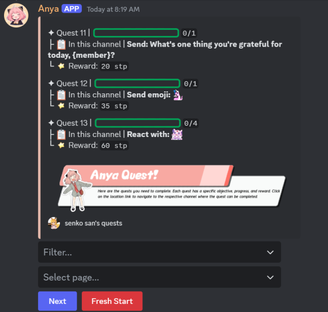
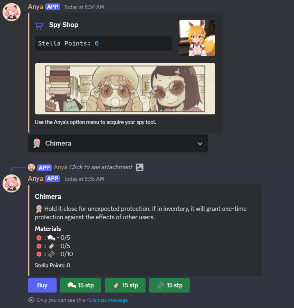
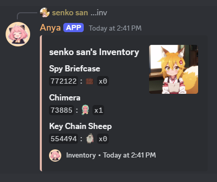
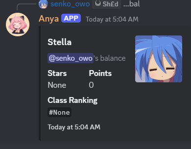

# Anya Bot


| Command                | Description                                                                                                   | Image                                         |
|------------------------|---------------------------------------------------------------------------------------------------------------|-----------------------------------------------|
| `...quest`    | The `...quest` command allows users to start new quests or check the progress of their ongoing quests. This is the heart of the game mechanics, where players interact with different quests to earn rewards (stella points). It encourages players to actively participate in the server and interact with other members. Anya wants you to make new friends and be active in the community. |     |
| `...shop`      | The `...shop` command lets players view the shop's available items so they can create their own spy tools. These tools allow you to acquire roles in the server and more, making it fun and rewarding to stay active. The setup is simple and easy, making you feel like an actual craftsman. Anya always wanted a pistol with a silencer; now you can create your very own, along with other items she desires. |       |
| `...inventory` | With `...inventory`, users can see all the items they have collected throughout their quests and purchases. Being a spy is all about stealth, and each item has its own interactive ID. When you use the ID, it allows you to interact with the item or with other users. Quite exciting (very waku waku)! The layout is sleek and easy to follow, ensuring you feel like a top spy—organized and prepared to handle a bunch of bad guys while on a secret mission. |  |
| `...balance`    | Use the `...balance` command to check your status in the server. It shows how many Stella Stars / Stella Points you've earned and your class ranking, so others can recognize your dedication and respect your progress. While you can also view your balance in `...shop`, think of this command as more of a status indicator than just a balance check. After all, spies need a specialized, verified wallet! > w < |  |
> [!TIP]  
> Try using the `...help <command_name>` command for assistance.

---
### ⚙️ Setup 
> Go to `.github`
   ```env
   MONGO_URI= https://cloud.mongodb.com  # Go to MongoDB to create a database called 'Bot' and a collection named 'information'
   HUGGINGFACE_API_KEY= https://huggingface.co/settings/tokens  # Go to Hugging Face to generate your API key
   OPENAI_KEY= https://openai.com/index/openai-api/  # Go to OpenAI to get your API key
   Stable_Diffusion_API_URL= https://github.com/AUTOMATIC1111/stable-diffusion-webui/wiki/API  # Go to the Stable Diffusion API documentation for the URL
   ```


## ☁️ Status

[](https://discordbots.org/bot/1234247716243112100)[](https://discordbots.org/bot/1234247716243112100)
> [!IMPORTANT]  
> Bot is still undergoing development.


